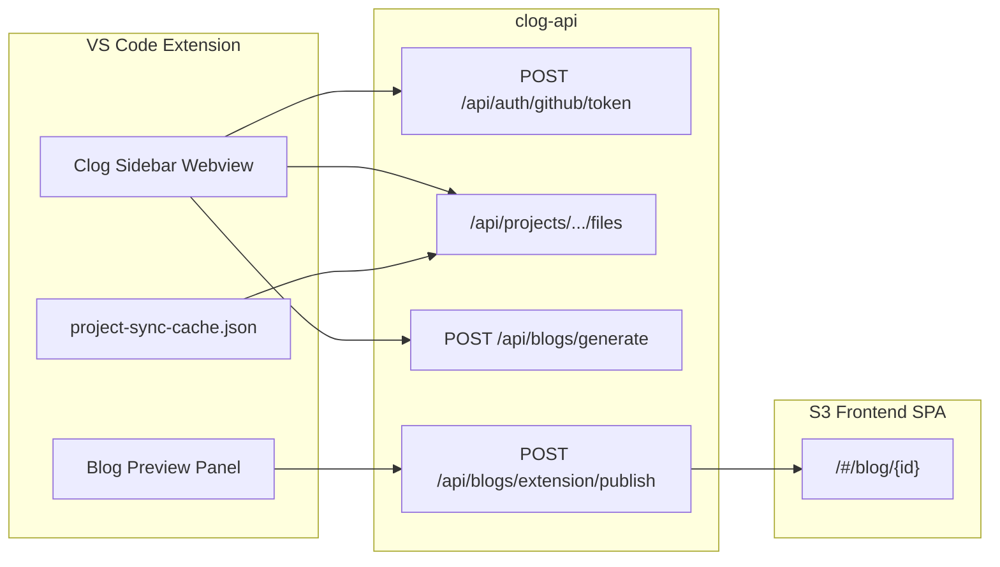
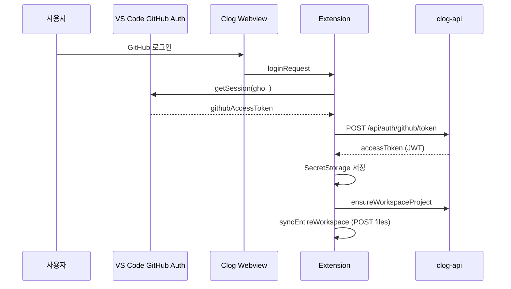

# Clog — VS Code Extension

코드 편집 맥락을 바탕으로 AI 블로그 초안을 생성·미리보기·발행하는 VS Code 확장 프로그램입니다.  
백엔드 API(`clog-api`), 웹 프론트(S3 SPA), Extension이 분리되어 있으며, Extension은 **API 서버**와 **프론트 공개 URL**을 각각 다른 설정으로 바라봅니다.

---

## 목차

1. [개요](#개요)
2. [시스템 구성](#시스템-구성)
3. [기술 스택](#기술-스택)
4. [프로젝트 구조](#프로젝트-구조)
5. [백엔드 API 연동](#백엔드-api-연동)
6. [인증](#인증)
7. [프로젝트·파일 동기화](#프로젝트파일-동기화)
8. [채팅·SSE 블로그 생성](#채팅sse-블로그-생성)
9. [블로그 미리보기·발행](#블로그-미리보기발행)
10. [설정](#설정)
11. [개발·디버깅](#개발디버깅)
12. [배포 체크리스트](#배포-체크리스트)
13. [트러블슈팅](#트러블슈팅)
14. [라이선스](#라이선스)

---

## 개요

| 항목 | 설명 |
|------|------|
| **대상 사용자** | VS Code에서 작업하는 개발자 |
| **핵심 가치** | 선택/저장된 코드 → LLM 블로그 초안 → 편집 → 공개 URL 발행 |
| **UI** | Activity Bar **Clog** 사이드바(React Webview) + **Blog Preview** 패널 |
| **백엔드** | Spring Boot (`https://clog.r-e.kr` 등) |
| **프론트** | S3 정적 호스팅 SPA (`/#/blog/{id}`) |

### 주요 기능

- GitHub OAuth 세션(`gho_`) → CLOG JWT 교환 후 사이드바 채팅
- 워크스페이스 소스 파일 **최초 일괄 업로드** + **Ctrl+S 시 unified diff** 동기화
- `POST /api/blogs/generate` SSE 스트리밍(assistant + 마크다운 미리보기)
- WYSIWYG 미리보기에서 **블로그 만들기** → `POST /api/blogs/extension/publish`
- 발행 링크: 프론트 S3 origin + `/#/blog/{blogId}` (API 도메인과 분리)

---

## 시스템 구성



| 구분 | URL 예시 | 역할 |
|------|----------|------|
| API | `https://clog.r-e.kr` | JWT, 프로젝트 파일, SSE, 발행 API |
| 프론트 | `http://clog-frontend-project.s3-website.ap-northeast-2.amazonaws.com` | 발행 글 **읽기** (hash 라우트) |

> `clog.r-e.kr/#/blog/1` 로 열면 API 서버가 SPA를 제공하지 않아 **403 Whitelabel** 이 날 수 있습니다. 발행 링크는 반드시 **프론트 origin** 을 사용합니다.

---

## 기술 스택

| 영역 | 기술 |
|------|------|
| Extension | TypeScript, VS Code Extension API |
| Webview UI | React 19, Emotion, Vite |
| HTTP/SSE | `fetch` + `ReadableStream` (EventSource 미사용) |
| Diff | npm `diff` (createPatch), 서버 `contentDiff` 적용 |
| 패키지 매니저 | pnpm |

---

## 프로젝트 구조

```
clog/                          # VS Code Extension (본 저장소)
├── src/
│   ├── extension.ts           # 진입점, WebviewProvider·저장 리스너 등록
│   ├── providers/
│   │   └── ClogSidebarProvider.ts   # 인증, SSE, 동기화, 발행 오케스트레이션
│   ├── api/
│   │   ├── client.ts          # Bearer JWT, 요청/응답 로깅
│   │   ├── auth.ts            # GitHub 토큰 → JWT
│   │   ├── projects.ts        # 프로젝트·파일 CRUD
│   │   ├── blogs.ts           # SSE generate, extension publish
│   │   ├── sse.ts             # Spec A 이벤트 파싱
│   │   ├── blogUrl.ts         # 발행 공개 URL (#/blog/{id})
│   │   ├── tokenStorage.ts    # SecretStorage + globalState
│   │   └── apiProbe.ts        # 연동 스모크 테스트
│   ├── sync/
│   │   ├── workspaceFiles.ts  # findFiles (최대 20개, 50KB)
│   │   ├── projectSync.ts     # Initial POST / Ctrl+S PUT diff
│   │   └── projectSyncCache.ts
│   └── utils/
│       ├── previewPanel.ts    # Blog Preview + 발행 버튼
│       └── previewHtml.ts
└── webview-ui/                # 사이드바 React 앱 → dist/

backend-repo/                  # Spring Boot API (별도 저장소)
└── docs/API_SPEC.md           # API 상세 명세
```

---

## 백엔드 API 연동

Extension **전용·공유** API 기준 적용 현황입니다.

### 4.1 인증·프로필

| Method | Path | Extension 사용 | 비고 |
|--------|------|----------------|------|
| POST | `/api/auth/github/token` | ✅ | VS Code `gho_` → CLOG JWT |
| GET | `/api/users/{userId}` | ❌ | JWT `sub`는 디버그 로그만 |

### 4.2 프로젝트·파일 (MongoDB)

| Method | Path | Extension 사용 | 비고 |
|--------|------|----------------|------|
| POST | `/api/projects` | ✅ | 워크스페이스명으로 프로젝트 생성/조회 |
| GET | `/api/projects` | ✅ | `ensureWorkspaceProject` |
| DELETE | `/api/projects/{projectId}` | ❌ | 래퍼만 존재 |
| POST | `/api/projects/{projectId}/files` | ✅ | **최초 동기화** 신규 파일 |
| GET | `/api/projects/{projectId}/files` | ✅ | 목록 (content 없음) |
| PUT | `/api/projects/{projectId}/files/{fileId}` | ✅ | **Ctrl+S** `contentDiff` 또는 전체 `content` |
| DELETE | `/api/projects/{projectId}/files/{fileId}` | ❌ | — |

### 4.3 채팅·발행·생성

| Method | Path | Extension 사용 | 비고 |
|--------|------|----------------|------|
| POST | `/api/chat/send` | ❌ | 코드에 `streamChatSend`만 있음; **실제 UI는 `/api/blogs/generate`** |
| POST | `/api/blogs/extension/publish` | ✅ | 미리보기 「블로그 만들기」 |
| POST | `/api/blogs/generate` | ✅ | 사이드바 채팅 SSE |

### Extension이 사용하지 않는 API (Web·기타)

- `GET /api/auth/github/callback`
- 블로그 DRAFT CRUD, 피드, 댓글, 북마크, 퀴즈
- `GET /api/v1/blog/posts`

---

## 인증



| 저장소 | 키 | 내용 |
|--------|-----|------|
| SecretStorage | `clog.accessToken` | CLOG JWT |
| globalState | `clog.projectId` | 워크스페이스 프로젝트 ID |
| globalState | `clog.chatSessionId` | SSE `done.sessionId` |
| storageUri | `clog-project-sync-cache.json` | 파일별 baseline·fileId·lastDiff |

**로그인 조건:** GitHub 세션 + CLOG JWT 모두 있을 때 Editor 화면 표시.

---

## 프로젝트·파일 동기화

### 최초 동기화 (로그인·캐시 없음)

1. `GET /api/projects/{projectId}/files` 로 서버 목록 조회
2. 워크스페이스 **전체 파일** 수집 (`**/*`, `node_modules`·`.git` 등 제외, 바이너리·50KB 초과 제외)
3. 서버에 없는 파일 → **`POST .../files`** (전체 `content`)
4. 캐시에 `fileId`, `baselineContent` 저장

### Ctrl+S 저장 시

1. 캐시/`projectId` 없으면 Initial Sync 재시도
2. 캐시에 없는 파일 → lazy **`POST .../files`**
3. `baseline` vs 현재 내용 비교 → 변경 시 **`PUT .../files/{fileId}`** body `{ contentDiff: "<unified patch>" }`
4. 서버가 patch를 적용해 `content` 갱신 (백엔드 `UnifiedDiffApplier`)
5. 캐시 baseline·`lastDiff` 갱신; 발행 시 `codeDiff`로 누적 가능

### 제한

- 동기화 대상: 워크스페이스 **루트 안 모든 파일** (`clog.maxProjectSyncFiles`, 기본 10000)
- 제외: `node_modules`, `.git`, `dist`, `build` 등 + 이미지·폰트·zip 등 바이너리 확장자
- 파일당 최대 **50KB** (`app.project.max-file-bytes`)
- 서버: `APP_PROJECT_MAX_FILES` (기본 **200**) — 파일 수가 더 많으면 서버 env를 올려야 함

---

## 채팅·SSE 블로그 생성

| 항목 | 값 |
|------|-----|
| 엔드포인트 | `POST /api/blogs/generate` |
| 인증 | `Authorization: Bearer <JWT>` |
| Body | `message`, `projectId`, `chatSessionId`, `codeSnippets` |
| 클라이언트 | `fetch` + `ReadableStream` (EventSource 불가) |

### SSE 이벤트 (Spec A)

| event | UI 반영 |
|-------|---------|
| `started` / `iteration_*` | thinking 텍스트 |
| `answer` (delta) | assistant 메시지 |
| `blog` (delta) | 미리보기 마크다운 + Blog Preview 패널 |
| `complete` / `done` | 스트림 종료, `sessionId` 저장 |

### UI 안정화

- `draftId`로 요청별 메시지 분리 (이전 요청 abort 시 오류 문구 미표시)
- 한글 IME 조합 중 Enter 전송 방지
- 빈 assistant 말풍선 제거, 스트리밍 중 중복 전송 잠금

---

## 블로그 미리보기·발행

1. SSE로 `previewMarkdown` 수신 → **Blog Preview** 패널 자동 오픈 (옆 탭)
2. 사이드바 **「블로그 미리보기 · 만들기」** 로 재오픈 가능
3. 에디터에서 HTML 편집 후 **「블로그 만들기」** 클릭
4. `POST /api/blogs/extension/publish`  
   - `title`, `content`(HTML), `visibility`, `chatSessionId`, `codeDiff`(선택)
5. 공개 URL 생성 (Extension이 **항상 프론트 origin** 사용):

```
http://clog-frontend-project.s3-website.ap-northeast-2.amazonaws.com/#/blog/{blogId}
```

백엔드 `blogUrl` 필드가 API 도메인을 가리켜도 Extension·설정에서 S3 URL로 덮어씁니다.

---

## 설정

VS Code `settings.json`:

| 키 | 기본값 | 설명 |
|----|--------|------|
| `clog.apiBaseUrl` | `https://clog.r-e.kr` | **API** 베이스 URL |
| `clog.blogPublicBaseUrl` | `http://clog-frontend-project.s3-website.ap-northeast-2.amazonaws.com` | **발행 글** SPA origin |
| `clog.maxProjectSyncFiles` | `10000` | Initial sync 수집 상한 |

로컬 API 테스트:

```json
{
  "clog.apiBaseUrl": "http://localhost:8080"
}
```

---

## 개발·디버깅

### 설치·빌드

```bash
pnpm install
pnpm run webview:build
pnpm run compile
```

### Extension 실행

1. 본 repo를 VS Code에서 연다
2. **F5** → Extension Development Host
3. **편집할 프로젝트 폴더**를 Host 창에서 연다 (동기화 대상)
4. Activity Bar **Clog** → GitHub 로그인
5. 채팅 전송 / Ctrl+S / 발행 테스트

### Output 채널

**View → Output → `Clog API Debug`**

| 로그 접두사 | 의미 |
|-------------|------|
| `[Clog Auth]` | GitHub·JWT 상태 |
| `[Initial Sync]` | `POST .../files` 일괄 업로드 |
| `[Ctrl+S]` | diff PUT 또는 SKIP 사유 |
| `[Clog SSE]` | generate 요청·이벤트 |
| `[Publish]` | extension publish 결과 |

### 커맨드

| 커맨드 | 설명 |
|--------|------|
| `Clog: Open Sidebar` | 사이드바 포커스 |
| `Send Code to Blog Creator` | 선택 코드를 채팅 첨부 대기 (`Ctrl/Cmd+Shift+B`) |
| `Clog: Run API Integration Probe` | 공개 API·JWT·projects·SSE 스모크 |

---

## 배포 체크리스트

### Extension

- [ ] `pnpm run webview:build && pnpm run compile`
- [ ] `vsce package` 또는 마켓 배포

### clog-api (EC2 등)

```bash
APP_BLOG_PUBLIC_BASE_URL=http://clog-frontend-project.s3-website.ap-northeast-2.amazonaws.com
```

- [ ] `SecurityConfig`: SSE용 `DispatcherType.ASYNC` permitAll ([`SSE_ASYNC_SECURITY_FIX.md`](../backend-repo/docs/SSE_ASYNC_SECURITY_FIX.md))
- [ ] `contentDiff` PUT 지원 배포 (`java-diff-utils`)
- [ ] CORS에 S3 프론트 origin 포함

### 프론트 (S3)

- [ ] SPA hash 라우트 `/#/blog/:id` 동작
- [ ] API 호출 origin/CORS와 Extension `clog.apiBaseUrl` 일치

---

## 트러블슈팅

| 증상 | 원인 | 조치 |
|------|------|------|
| Ctrl+S `동기화 캐시 없음` | 로그인·Initial Sync 미완료 | 사이드바 로그인, Debug에 `[Initial Sync] 완료` 확인 |
| Ctrl+S `워크스페이스 밖 파일` | Host 워크스페이스와 파일 경로 불일치 | Host에서 대상 repo 루트로 폴더 열기 |
| SSE 200 후 끊김 / 403 | ASYNC dispatch 인증 | 백엔드 SecurityConfig 배포 |
| 발행 URL 403 (Whitelabel) | API 도메인으로 `#/blog` 접근 | S3 `blogPublicBaseUrl` 확인 |
| `contentDiff` 400 | API 미배포 | 백엔드 재배포 |
| 채팅 마지막 글자만 또 보내짐 | IME + Enter | webview 재빌드 반영 여부 확인 |
| 블로그 만들기 무반응 | Preview `onPublish` 미연결 | Extension 재로드 |

---

## 관련 문서

| 문서 | 위치 |
|------|------|
| API 명세 | `../backend-repo/docs/API_SPEC.md` |
| 클라이언트별 API | `../backend-repo/docs/API_SPEC_BY_CLIENT.md` |
| 프로젝트 파일·컨텍스트 | `../backend-repo/docs/프로젝트_코드베이스_컨텍스트_설계.md` |
| SSE Security | `../backend-repo/docs/SSE_ASYNC_SECURITY_FIX.md` |

---

## 라이선스

MIT
