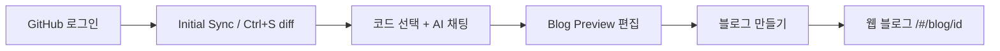

# Clog — VS Code Extension

**IDE를 벗어나지 않고**, 작성 중인 코드와 프로젝트 맥락을 바탕으로 **기술 블로그 초안을 생성·편집·발행**하는 VS Code 확장 프로그램입니다.

CLOG(Code + Log)는 건국대학교 컴퓨터공학부 졸업프로젝트로 개발된 **개발자 전용 AI 블로그 작성 플랫폼**의 일부이며, 본 Extension은 그 흐름의 **시작점(IDE)** 역할을 담당합니다.

| 서비스 | URL |
|--------|-----|
| **웹 블로그** (발행 글 열람) | http://clog-frontend-project.s3-website.ap-northeast-2.amazonaws.com |
| **백엔드 API** | https://clog.r-e.kr |

---

## CLOG가 해결하는 문제

일반 LLM 채팅은 코드를 직접 붙여 넣지 않으면 프로젝트 구조를 모르고, 여러 프로젝트를 한 세션에서 다루면 **이전 프로젝트 코드·대화가 섞이는 컨텍스트 오염**이 생깁니다.

CLOG Extension은 다음을 통해 **「이 프로젝트의 이 시점」** 맥락을 시스템이 유지하도록 돕습니다.

| 강점 | 설명 |
|------|------|
| **프로젝트별 코드베이스 격리** | 워크스페이스 파일을 프로젝트 단위로 서버에 동기화하고, AI는 해당 `projectId`의 코드만 검색·참조합니다. |
| **프로젝트별 채팅 세션** | 프로젝트마다 별도 채팅 세션이 유지되어, 다른 레포 작업 내용이 블로그 생성에 섞이지 않습니다. |
| **BM25 기반 코드 검색** | 별도 Vector DB 없이 식별자 중심 검색으로 관련 코드 근거를 찾아 초안에 반영합니다. |
| **작성자 톤 반영** | 기존에 발행한 블로그 글 스타일을 참고해, 개인적인 글쓰기 톤에 맞춘 초안을 생성합니다. |
| **IDE 안에서 끝까지** | GitHub 로그인 → 코드 동기화 → AI 채팅 → TipTap 미리보기 → 웹 발행까지 **VS Code 안**에서 완료합니다. |
| **효율적인 동기화** | 로그인 직후 전체 텍스트 파일을 업로드하고, 이후 **Ctrl+S** 시에는 변경분만 **unified diff**로 전송합니다. |

> 백엔드(Spring Boot), AI 서비스(AWS Lambda), 웹 블로그(React SPA)는 별도로 배포·운영됩니다. Extension은 **API**와 **발행 글용 웹 URL**만 설정으로 연결합니다.

---

## 빠른 시작

### 1. 설치

- VS Code **Extensions**에서 **Clog** 검색 후 설치  
  *(또는 배포된 `.vsix`를 **Install from VSIX**로 설치)*

### 2. 워크스페이스 열기

블로그로 다룰 **프로젝트 폴더**를 VS Code에서 연 뒤, Activity Bar의 **Clog** 아이콘을 클릭합니다.

### 3. GitHub 로그인

사이드바에서 **GitHub 로그인**을 진행합니다. VS Code에 연결된 GitHub 계정(`gho_` 세션)으로 CLOG JWT가 발급되며, 로그인 직후 **워크스페이스 파일이 서버에 초기 동기화**됩니다.

### 4. 블로그 초안 만들기

1. 설명하고 싶은 **코드를 선택**한 뒤 `Ctrl+Shift+B` (macOS: `Cmd+Shift+B`)로 채팅에 첨부하거나, 사이드바에 직접 프롬프트를 입력합니다.
2. AI가 **답변**과 함께 **블로그 마크다운 초안**을 스트리밍으로 보여 줍니다.
3. **Blog Preview** 패널이 열리면 TipTap 에디터에서 내용을 다듬습니다.
4. **「블로그 만들기」**를 누르면 웹 블로그에 발행되고, **공개 URL**이 표시됩니다.

발행된 글은 웹 블로그에서 확인합니다.

```
http://clog-frontend-project.s3-website.ap-northeast-2.amazonaws.com/#/blog/{blogId}
```

---

## 주요 기능

### GitHub OAuth 로그인

VS Code 내장 GitHub 인증을 사용합니다. 별도 브라우저 OAuth 리다이렉트 없이 사이드바에서 로그인할 수 있습니다.

### 워크스페이스 자동 동기화

| 시점 | 동작 |
|------|------|
| **로그인 직후** | 워크스페이스의 텍스트 소스 파일을 서버에 일괄 업로드 (Initial Sync) |
| **파일 저장 (Ctrl+S)** | 이전 baseline과 비교해 **변경분만 diff**로 서버에 반영 |

`node_modules`, `.git`, `dist` 등과 이미지·바이너리는 제외됩니다. 파일당 최대 **50KB**까지 동기화됩니다.

### AI 블로그 생성 (SSE)

- 사이드바 채팅에서 프롬프트 전송 → `POST /api/blogs/generate` **SSE 스트리밍**
- 진행 상태(thinking), assistant 답변, 블로그 미리보기 마크다운이 실시간으로 표시됩니다.
- ReAct 기반 AI가 `search_codebase`, `get_user_blog_posts` 등 도구로 **코드 근거**와 **글 톤**을 수집한 뒤 초안을 작성합니다.

### 미리보기 · 발행

- SSE로 수신한 마크다운이 **Blog Preview** 패널(옆 탭)에 자동으로 열립니다.
- HTML로 편집한 뒤 **「블로그 만들기」** → `POST /api/blogs/extension/publish`
- 발행 링크는 **웹 블로그(S3 SPA) origin**을 사용합니다. API 도메인(`clog.r-e.kr`)으로 `/#/blog/...`를 열면 403이 날 수 있으니 주의하세요.

---

## 사용 흐름



**백엔드 처리 흐름 (참고):** Extension → Spring Boot(인증·세션) → AWS Lambda(AI/ReAct/BM25) → SSE로 Extension·미리보기에 스트리밍

---

## 명령어 · 단축키

| 동작 | 방법 |
|------|------|
| Clog 사이드바 열기 | Activity Bar **Clog** 또는 명령 팔레트 `Clog: Open Sidebar` |
| 선택 코드를 채팅에 보내기 | 에디터에서 코드 선택 → `Ctrl+Shift+B` / `Cmd+Shift+B` 또는 우클릭 메뉴 |
| 블로그 미리보기 다시 열기 | 사이드바 **「블로그 미리보기 · 만들기」** |
| API 연동 점검 (고급) | 명령 팔레트 `Clog: Run API Integration Probe` |

---

## 설정

기본값은 **운영 환경**을 가리킵니다. 로컬 API 개발 시에만 변경하세요.

**File → Preferences → Settings**에서 `clog` 검색:

| 설정 키 | 기본값 | 설명 |
|---------|--------|------|
| `clog.apiBaseUrl` | `https://clog.r-e.kr` | CLOG 백엔드 API |
| `clog.blogPublicBaseUrl` | `http://clog-frontend-project.s3-website.ap-northeast-2.amazonaws.com` | 발행 글 **웹 앱** origin (`/#/blog/{id}`) |
| `clog.maxProjectSyncFiles` | `10000` | Initial Sync 시 수집할 파일 수 상한 |

로컬 백엔드 예시:

```json
{
  "clog.apiBaseUrl": "http://localhost:8080"
}
```

---

## 디버그 로그 (문제 해결 시)

**View → Output → `Clog API Debug`** 채널에서 다음 접두사를 확인할 수 있습니다.

| 접두사 | 의미 |
|--------|------|
| `[Clog Auth]` | GitHub·JWT 로그인 상태 |
| `[Initial Sync]` | 로그인 후 파일 일괄 업로드 |
| `[Ctrl+S]` | 저장 시 diff 동기화 |
| `[Clog SSE]` | AI 블로그 생성 스트림 |
| `[Publish]` | 발행 API 결과 |

---

## 트러블슈팅

| 증상 | 가능한 원인 | 해결 방법 |
|------|-------------|-----------|
| 로그인 후 채팅이 안 됨 | JWT·네트워크 | Output `[Clog Auth]` 확인, GitHub 계정 연결 후 Extension 재로드 |
| Ctrl+S 후 `동기화 캐시 없음` | Initial Sync 미완료 | 사이드바 로그인 후 `[Initial Sync] 완료` 로그 확인 |
| `워크스페이스 밖 파일` | 잘못된 폴더 열림 | 블로그로 쓸 **프로젝트 루트**를 VS Code에서 폴더로 연 상태에서 저장 |
| AI 응답이 중간에 끊김 | SSE·서버 일시 오류 | 잠시 후 재시도; 지속 시 Output `[Clog SSE]` 확인 |
| 발행 URL이 403 (Whitelabel) | API 도메인으로 블로그 URL 접근 | `clog.blogPublicBaseUrl`이 **S3 웹 블로그 origin**인지 확인 |
| 미리보기는 되는데 발행이 안 됨 | Preview 연결·로그인 | Extension 재로드, 로그인 상태·`[Publish]` 로그 확인 |
| 채팅 시 마지막 글자가 두 번 전송됨 | 한글 IME + Enter | 최신 Extension 버전 사용 (조합 중 Enter 전송 방지) |
| 동기화 파일이 일부만 됨 | 크기·개수 제한 | 50KB 초과·바이너리 제외; 서버 파일 수 한도(기본 200) 초과 시 관리자에게 문의 |
| 다른 폴더를 열어도 같은 한도 오류 | 예전 Extension은 **폴더 이름만**으로 서버 프로젝트를 구분 | 최신 Extension은 `폴더이름__해시`로 경로별 프로젝트 분리; Extension 리로드 후 폴더 다시 열기 |

---

## CLOG 플랫폼 구성

본 저장소는 **VS Code Extension**입니다. CLOG 전체는 아래 컴포넌트로 구성됩니다.

| 컴포넌트 | 역할 |
|----------|------|
| **VS Code Extension** (본 repo) | 로그인, 파일 동기화, AI 채팅, 미리보기, Extension 발행 API 호출 |
| **Web Blog SPA** | 발행 글 목록·상세, 댓글·북마크 등 CMS |
| **Spring Boot Backend** | 인증, 프로젝트/파일, 채팅 세션, SSE 프록시, 블로그 API |
| **AWS Lambda AI Service** | ReAct, BM25 코드 검색, OpenAI 연동 |

---

## 기여자 · 개발

Extension 소스를 직접 빌드·실행하려면:

```bash
pnpm install
pnpm run webview:build
pnpm run compile
```

VS Code에서 **F5** → Extension Development Host → 대상 프로젝트 폴더를 연 뒤 Clog 사이드바에서 테스트합니다.

---

## 알려진 한계

- JWT **Refresh Token**이 없어 만료 시 재로그인이 필요할 수 있습니다.
- 동기화 대상은 텍스트 소스 위주이며, 대용량·바이너리 파일은 제외됩니다.
- AI 검색은 현재 **BM25 중심**이며, 장기적으로 Hybrid Search 등 확장을 검토 중입니다.

---

## 라이선스

MIT
